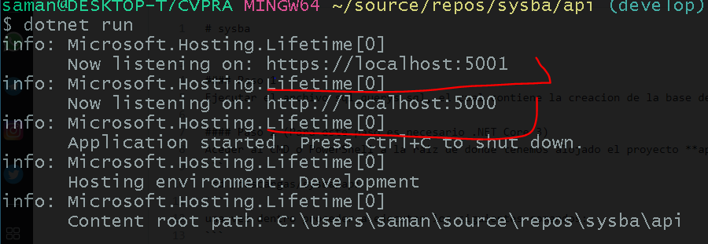
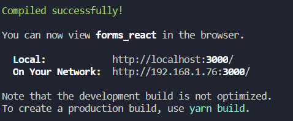
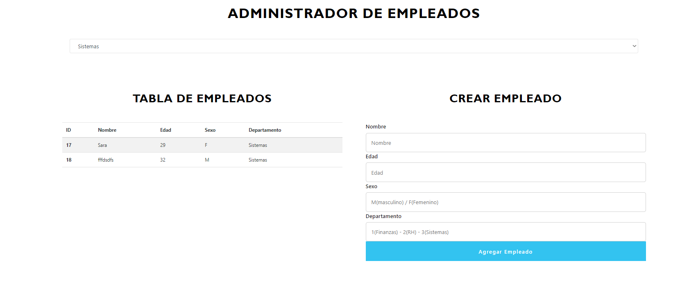

# sysba


### Paso 1
Ejecutar el archivo sql_querys.sql, el cual contiene la creacion de la base de datos, creacion de tablas y procedimientos almacenados.

### Paso 2 (Para este paso es necesario .NET Core 3)
Aceder al CMD o PowerShell a la raiz de donde tenemos alojado el proyecto **api**, ejemplo:
```
 cd /descargas/sysba/api
```
una vez dentro proceder a ejecutar los siguientes comandos:
```
  dotnet --info
```
si al correr el comando anterior muestra que no existe, de debe instalar el SDK de .NET Core *https://versionsof.net/core/3.1/3.1.1/* 

de lo contrario, podemos continuar.
```
  dotnet restore
  dotnet build
  dotnet run
```

al finalizar deberia aparecer una pantalla como la siguiete:



**Lista de EndPoints** 
* https://localhost:5001/api/empleados - Muestra todos los empleados registrados
* https://localhost:5001/api/empleados/departamento/1 - Muestra todos los empleados registrado por departamento, puedes cambiar el ultimo valor por 1, 2 y 3
* https://localhost:5001/api/departamento - Muestra todos los departamentos resgitrados
* https://localhost:5001/api/empleados - Inserta un nuevo empleado, se envia un JSON con la siguiente estructura: 
`
{
    "nombre": "Juan",
    "edad": 31,
    "sexo": "M",
    "id_departamento": 1
}
`


### Paso 3 
Abrimos una nueva consola, y no dirigimos al lugar donde tenemos almacenado nuetro proyecto **client**
```
 cd /descargas/sysba/client
```


procedemos a ejecutar los siguientes comandos:

```
  npm i
```
Este comando puede tardar unos minutos.

```
  npm start
```
Una vez ejecutado, deberia mostrar una patalla como la siguiete:




Y una vez hecho esto pse puede probrar la aplicione web, accediendo a la url que nos muestra la pantalla anterior, por default *http://localhost:3000*




*Cosas  a considerar:*
 - Tener instalado NodeJS
 - Checar la cadena de conexion, en el archivo Conn.cs de la api